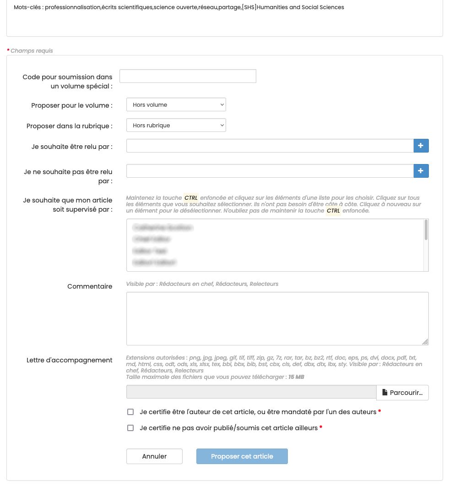

# Soumettre un article

> **Rôle** : auteur

## Préalable
Le compte HAL est utilisé pour se connecter sur les sites des épi-revues. En cas de premier dépôt ou si vous ne disposez pas de compte HAL, vous devez vous créer un compte.

La soumission d’un article à une épi-revue se fait en deux étapes :
1. dépôt de la proposition d’article (pré-print) dans une archive ouverte (arXiv, HAL, Zenodo or CWI) ;
2. soumission du pré-print sur le site Episciences de l’épi-revue.

## Se connecter au site
Pour se connecter au site d’une épi-revue, cliquer sur le bouton “Connexion” en haut à droite.

Une fois connecté, cliquer sur l’onglet “Proposer un article”.

+ **Archive** : sélectionner l’archive ouverte dans lequel se trouve l’article à soumettre à l’épi-revue ;
+ **Identifiant du document** : indiquer l’identifiant du document sur l’archive ouverte (ex : hal-0000000 pour HAL ; 0000.0000 pour arXiv ; 10.5281/zenodo.0000000 ou 0000000 pour Zenodo) ;
+ **Version** : préciser la version du document à soumettre.

Les métadonnées (prénoms et noms des auteurs, titre, résumé et mots-clés) sont récupérées par le système.

Suivant les paramétrages du site, il est possible de proposer l’article pour un volume ou une rubrique dédiée, de suggérer des noms de relecteurs ou encore de joindre une lettre d’accompagnement.

Le champ libre “Commentaire” permet d’ajouter un mot à l’attention de l’équipe éditoriale de la revue (ce commentaire sera visible des rédacteurs en chefs, rédacteurs et relecteurs).

Afin de pouvoir soumettre l’article, il est nécessaire de certifier :
+ être l’auteur de cet article ou bien être mandaté par l’un des auteurs dans le cadre d’un article écrit à plusieurs ; 
+ ne pas avoir publié ou soumis cet article ailleurs.

Cliquer sur “Proposer cet article” pour valider le dépôt de la soumission.
